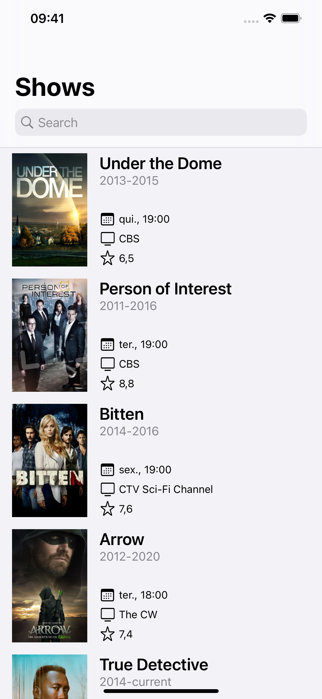
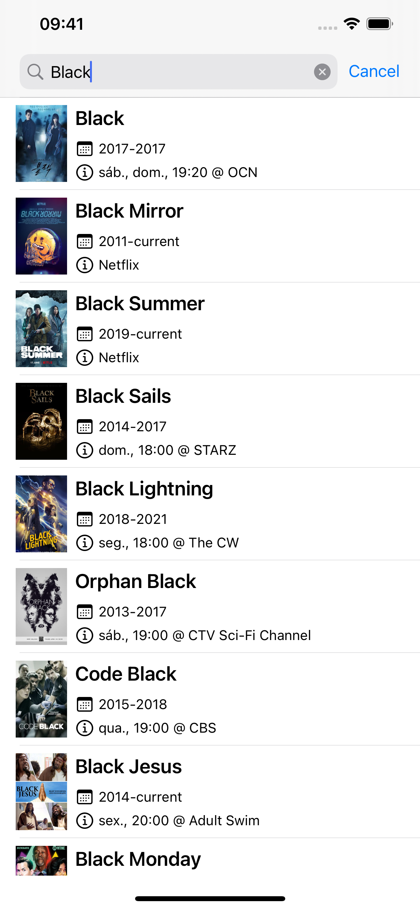
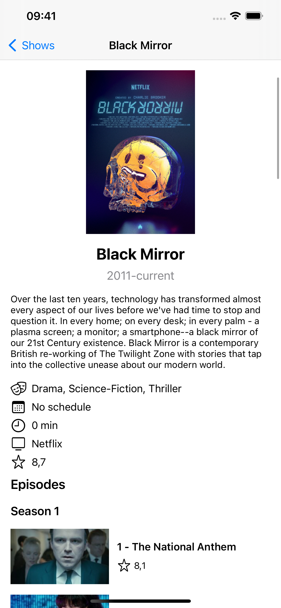
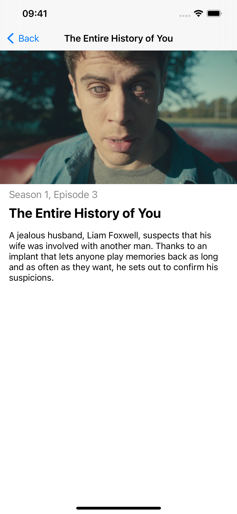

# TVMaze App

**Author:** [Rafael Araujo](rafaelruweraraujo@gmail.com)

**Screenshots**

   

## Technical

**Xcode 13.3.1**

**Architecture:** MVVM-C (Model-View-ViewModel with Coordinators)

**UI:** UIKit with ViewCode

**Dependencies:**
- [Kingfisher](https://github.com/onevcat/Kingfisher): load images from the API directly into `UIImageView`;
- [SwiftyJSON](https://github.com/SwiftyJSON/SwiftyJSON): parse payload from API calls.

## Features

- [x] List series with pagination (at least poster image and name)
- [x] Search series by name (at least poster image and name)
- [x] Show details of a series (name, poster, schedule, genres, summary and episodes by season)
- [x] Show details of an episode (name, number, season, summary and image)
- [ ] Let the user block the app with a PIN
- [ ] Let the user block the app with FaceID/TouchID
- [ ] Save a series as favorite
- [ ] Remove a series from favorites
- [ ] Browse favorites in alphabetical order and see series details
- [ ] List and search people by name (at least person photo and name)
- [ ] Show person details (name, photo and series they were credited in, with a link to the series details)
- [x] Dark Mode support
